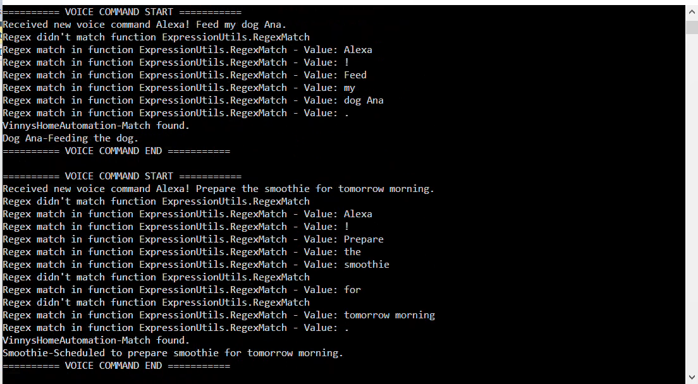

# Design Patterns Demo
My design patterns implementations on interesting scenarios

I have taken interesting problems and thought about applying the right design patterns. I maintain this repository to add/update such problems with design patterns.

This is a .net based solution and have tried as much to keep the code readable. 

Following are the design patterns implemented and the problem sceanrios chosen.

# Interpreter Design Pattern
Scenario chosen: A virtual assistant (Ex: Alexa) parsing simple english statements and interpreting the command. Delegate the command to the IOT devices. 

I have used regex grammar to interpret the sentences. 

Grammar Semantics:

expression ::= greeting & whitespace & action
greeting ::= (((interjection & whitespace)?(virtualassistant))) & punctuation 
// greeting - Eg: (((hi )?(alexa)))! matches 'hi alexa!' (or) 'alexa!'
whitespace ::= ' '
interjection ::=  ('hi' | 'hello' | 'hey')
virtualassistant ::= 'alexa'
punctuation ::= '!' | '.' | ','
action ::= action_verb & (whitespace & article)? & (whitespace & appliance_nickname) & (period | whitespace & preposition & whitespace & action_params & period) 
// action - Eg: turn-on (the )?(central ac|dish washer). matches 'turn-on ac' or 'turn-on the dish washer.'
period ::= '.'
preposition ::= 
article ::= 'the' | 'my'
appliance_nickname ::= 'central ac' | 'living room ac' | 'dog Ana' | 'garden sprinkler' | 'kitchen curtains' | 'dish washer' | 'kitchen lights' 
action_verb ::= 'turn-on' | 'turn-off' | 'prepare' | 'close' | 'feed' | 'set'
action_params ::=  duration | timeperiod
duration ::= [1-5][0-9]{0,2} (mins|hours)$ 
timeperiod ::= (tomorrow|today) ((([1-9]|0[1-9]|1[0-2])((.)(00|15|30|45))? (am|pm))|morning|evening|night|noon)
// tomorrow 12 am - match, tomorrow 12.12 am - no match, tomorrow 12.15 pm - match

Explanation

For the interpreter design pattern, I have selected the IOT automation scenario. You will command Alexa virtual assistant and it will pass on the comments to an IOT device which in turn passes the comments to the destined appliance. 
Ex: Hi Alexa! Turn on the central AC. 
This command is received from Alexa through human and then sent to IOT Device. The IOT Device will then send to the appliance. In this case, the appliance in Airconditioner. 
The interpreter design pattern will parse the command using regular expression and then sends the commands to appliance. 

Sample output

